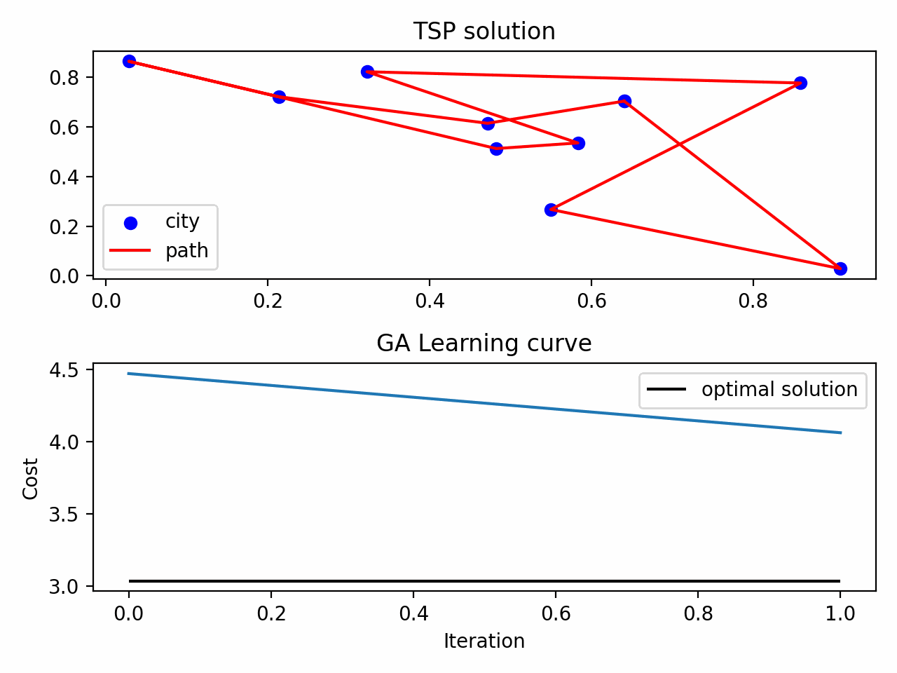

# TSP Genetic Algorithm

This is my own implementation for solving the TSP problem using Genetic Algorithm. TSP stands for traveling salesman problem aiming to find the shortest path to every city once within a country. Refer to wiki for more information

## How to run this project

```bash
python main.py
```

_Note_: Please don't try to use debug mode for large city. It's painfully slow.

## Technical stuff

- I use edge recombination operation as crossover strategy
- I only keep the best 100 population after the size grows large (this is different in the literature because in theory population grows unlimitedly until the memory runs out)

## Results


